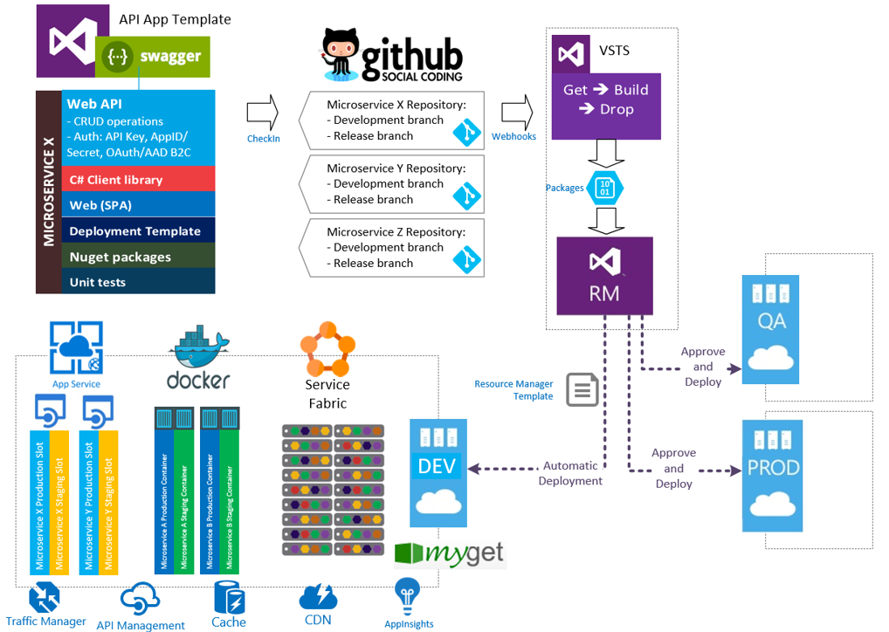

# Dnn.Microservices.TodoList
This is a microservice sample project including DNN Platform integration

This is the project that Cesar Abreu and me shared at the DNN Connect 2016 session. Check http://es.slideshare.net/davidjrh/getting-started-with-microservices

There is a new Visual Studio template to develop API Apps, including the swagger framework for documentation and discovery for the microservices APIs. Running API Apps helps on three specific features:
* Integrated support for API metadata
* CORS support
* Authentication and authorization support

The background for building these type of Microservices are described here: https://azure.microsoft.com/en-us/documentation/articles/app-service-api-dotnet-get-started/

So starting from this template, a microservice will be composed by:
* API App.- this is the RESTful service with all the operations and server logic. All security related features like authentication and authorization will be implemented here;
* C# Client library. - starting with the Azure SDK 2.8.1, building automatic API Apps client libraries comes out of the box. This client can be used then on other microservices or projects distributing the library as a nugget package;
* Web App (SPA). - this project will contain all the microservice static resources, such as JavaScript, CSS, images and html files. There are several reasons of having this project separately, such as CDN support in order to have the resources close to the client browser;
* Deployment template. - this is a new project type based on Azure Resource Manager (ARM) templates, specifying how this project is deployed. All resources needed by the microservice will be specified here and will be used later to automatically provision them: databases, web apps, monitoring, caching, etc. 
* NuGet packages. - this project will contain the C# client library, and the results will be published on a DNN NuGet server;
* Unit tests. - every microservice will have a unit test project to test its own exposed methods. This will be executed as part of the build process;



## How to use the NuGet packages ##
These packages are the easy way to connect a client application to the REST API service exposed by the microservices.
To make it to work in your projects, just follow these steps:
* Configure the DNN NuGet repository in your Visual Studio: In Visual Studio, go to `Tools > NuGet Package Manager > Package Manager Settings`, and add a new source in the "Package Sources" section. Give it a name and set this URL for the source: http://myget.dnndev.me/nuget (*TODO* explain how to create a local nuget repository)
* Once you have your DNN NuGet server configured, you only have to use it in your client applications. In Solution Explorer, just right click on your project node and select "Manage NuGet Packages...". Then, select your package source from the drop down list, and you'll see all the DNN NuGet packages availables.
* After you install your package, you can start using it with like in the following code:
```C#
var client = new TodoList.API.Client.TodoListAPI
{
    BaseUri = new Uri("http://localhost:21140/")
};

var result = client.TodoItems.GetTodoItems();
```
